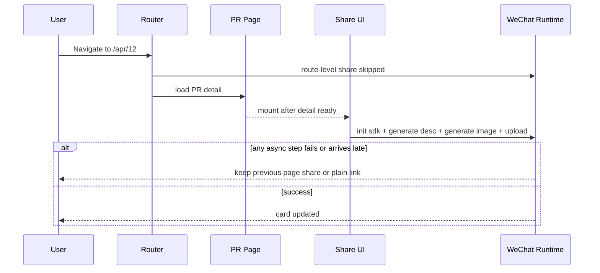
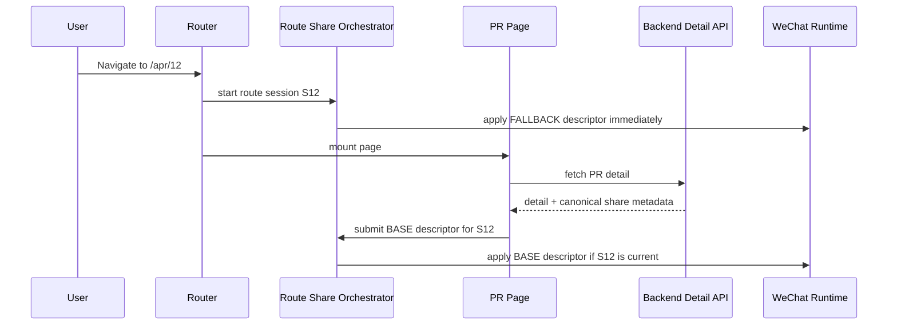
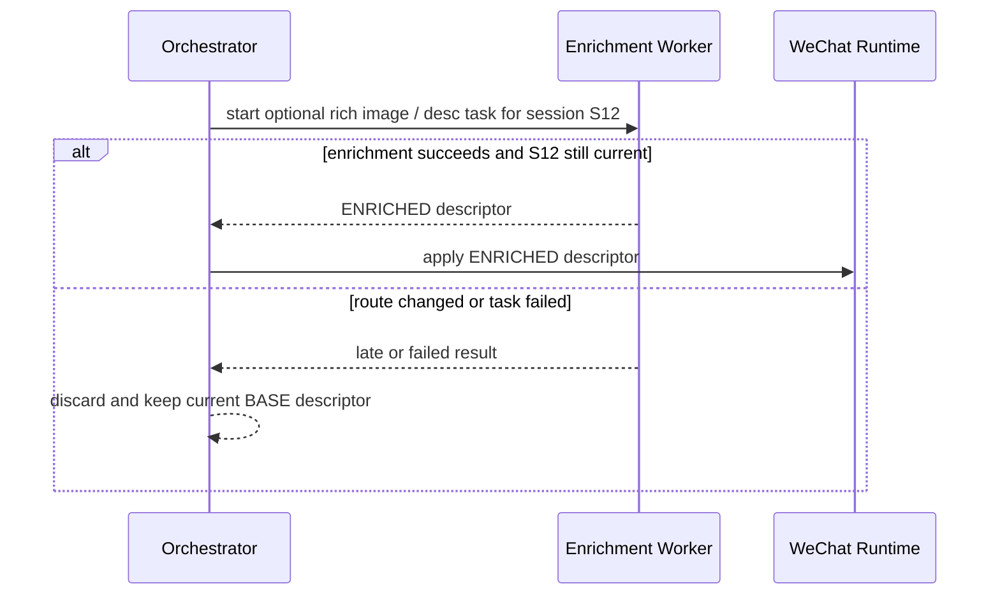
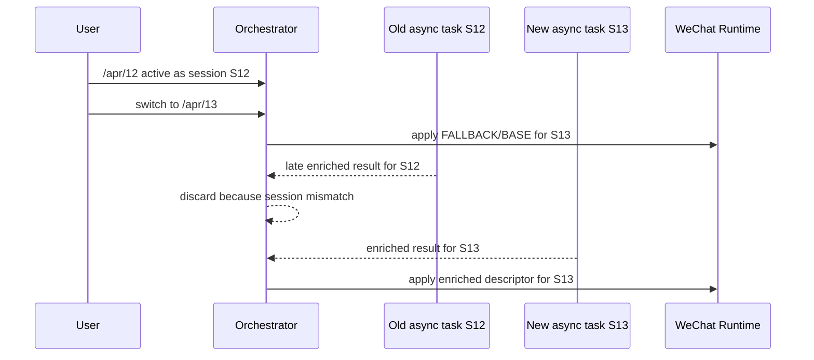

# Proposal: PR WeChat Share Long-Term Stabilization

## Task Name

`fix-pr-share-freq-lost`

## Goal

從系統設計角度重構 PR WeChat Share 的責任邊界、資料流與時序，解決下列長期不穩定現象，而不是持續對單點症狀打 patch：

- 有時沒有成功配置分享資料，最終只剩純連結
- 有時沒有刷新分享資料，卡片仍停在首頁或上一個頁面
- 平台差異放大了問題表現；實際觀察中 Android WeChat 更常出現異常

## Scope Anchors

### Frontend

- `anchor-pr-detail > share > wechat-card > configured / stale / missing`
- `community-pr-detail > share > wechat-card > configured / stale / missing`
- `app > processes > wechat/share > route lifecycle`

### Backend

- `wechat > jssdk-signature > signature issuance > route-bound config`
- `share > metadata/thumbnail/description > optional enrichment path`

## In Scope

- WeChat share 的系統拓撲分析
- active share ownership 重新分工
- route entry / detail-ready / param-switch / visibility-resume 的時序設計
- fallback share 與 rich share 的兩階段模型
- stale update discard、retry、replay、observability 設計

## Out Of Scope

- 本回合不直接修改 production code
- 本回合不直接更新 durable PRD / Product TDD
- 本回合不先決定最終 UI 文案與視覺樣式

## Core Judgment

這不是 4 個零碎 bug，而是一個系統級設計缺陷：

> 系統內沒有單一模組對「目前路由應該對外暴露的 share 狀態」負全責。

目前 share truth 同時分散在 route process、page、share UI、shared WeChat runtime、head metadata 與 backend optional endpoints 之間。結果是：

- 誰先完成 async，誰就可能覆寫 share 狀態
- 沒有任何地方保證「至少有一份正確 fallback share」
- 沒有任何地方保證「舊頁 async 結果不能覆寫新頁」
- HTML meta 與 WeChat SDK 走的是兩條平行但不同步的管線

## Current Topology Diagnosis

### 1. Current writer map

| Layer | Current module | Current role | Design problem |
| --- | --- | --- | --- |
| frontend process | `useRouteWeChatShare` | 只處理部分靜態 route 的 share 設定 | PR routes 被 `skip`，沒有 route-level 保底 |
| page/domain | `AnchorPRPage` / `CommunityPRPage` + `usePRShareContext` + `usePRDetailHead` | 組裝 share data 與 head metadata | page 知道資料，但不是 platform side-effect 的 owner |
| share UI | `ShareToWechatChat` + `useShareToWechatChat` | 預覽、縮圖生成、描述生成、直接呼叫 WeChat SDK | UI mount 被誤用成 active share writer |
| shared runtime | `useWeChatShare` | JS-SDK load/config/update | 只做底層 runtime，卻被多處直接驅動，沒有 route token 與 replay 策略 |
| backend | `/wechat/jssdk-signature` + `/share/wechat-card/*` | 簽名與 optional 富媒體生成 | 只提供能力，不提供 canonical active share contract |
| metadata channel | `usePRDetailHead` | HTML meta | 與 WeChat runtime 無同步關係 |

### 2. Current design-law violations

#### Violation A: Multiple active writers

active share state 目前沒有單一 writer。至少有：

- route-level static share writer
- PR detail page-derived writer
- WeChat share UI-derived writer

這違反了 route-scoped side effect 應該由 process layer 單點控制的基本原則。

#### Violation B: Platform side effect is coupled to UI mount

目前 rich WeChat share 的真正配置被綁在 `ShareToWechatChat` 這條 UI/use-case 鏈上。這表示：

- detail 還沒到，沒有 share
- UI 還沒 mount，沒有 share
- generation/upload 失敗，沒有 fallback replay

也就是說，「是否能正確分享」被錯誤地綁在 preview UI 的生命週期上。

#### Violation C: Base correctness is coupled to optional enrichment

真正穩定的 share 系統應該先保證：

- title 正確
- desc 正確
- target link 正確
- image 至少有穩定 fallback

目前系統把 rich thumbnail generation、AI desc generation、upload 與 active share update 混在一起，導致 optional enhancement 失敗時，base correctness 也跟著失敗。

#### Violation D: Async causality is untracked

目前沒有 route instance token、entity revision、request generation id 這類 causal identity。結果是：

- `/apr/12 -> /apr/13` 的晚到結果可能覆寫新頁
- 舊 thumbnail upload 完成後可能寫回錯頁
- late description 可能永遠不再同步到 SDK

#### Violation E: Signature URL and target URL are hidden in one flow

WeChat JSSDK `config` 使用的是當前頁 URL 的簽名身份；真正對外分享出去的 link 則應該是 canonical public URL。這兩者是不同語義，但目前沒有被建模成獨立欄位與獨立責任。

#### Violation F: No replay strategy

對 Android WeChat 類場景，分享設定不是「成功一次就永遠正確」。系統應該有能力在下列事件重放目前 active share：

- route 完成切換
- SDK ready
- `pageshow`
- `visibilitychange` 回到可見狀態

目前沒有這種 replay owner。

## Why The Current Symptoms Naturally Appear

### Symptom 1: 分享退回純連結

自然成因：

1. route 進入 `/apr/:id`
2. route-level share 被 `skip`
3. page detail 尚未完成，或 share UI 相關 async 尚未完成
4. generation/upload/SDK init 任何一步失敗
5. 系統沒有立即套用 fallback share
6. WeChat 最終只拿到原始頁面連結或舊狀態

### Symptom 2: 卡片仍是首頁或上一頁

自然成因：

1. 上一頁已經成功配置 share
2. 同 component route param 切換，share composable 未重跑，或舊 async 晚到
3. 新頁沒有 route-scoped owner 去覆蓋舊 share
4. 最終 active share 狀態仍保留上一頁

### Symptom 3: Android WeChat 更容易暴露問題

這不是因為 Android 是唯一 root cause，而是 Android WeChat 更容易把「沒有 replay / 沒有 owner / 依賴時序碰運氣」的設計缺陷放大。也就是說：

- Android 只是更常讓系統失敗
- 真正的問題仍然是系統沒有穩定的 share orchestration

## Target Architecture

## Design Principles

1. Active share state must have exactly one process-level owner.
2. Route entry 必須先拿到 deterministic fallback share。
3. Rich asset 只能是 enhancement，不能是 correctness prerequisite。
4. 所有 async 寫入都必須帶 route token / revision，晚到結果一律丟棄。
5. Signature identity 與 shared target URL 必須分開建模。
6. Share runtime 必須支援 replay，而不是一次性 imperative update。

## Target Topology

| Layer | Target owner | Owns | Must not own |
| --- | --- | --- | --- |
| backend | share metadata builder | canonical share title/desc/link/default image/revision | browser runtime、SDK replay |
| frontend process | route share orchestrator | active route share session、fallback/enrichment apply、stale discard、replay | domain-specific content derivation細節 |
| domain | share descriptor adapters | 把 PR / Event detail 轉成 canonical share descriptor | 直接調用 WeChat SDK |
| shared runtime | wechat sdk runtime | load/config/apply/replay primitives | 決定哪個 route 才是 current active share |
| share UI | preview + manual enrichment actions | 預覽、顯示目前狀態、觸發非關鍵 enhancement | active share single source of truth |

## Required New Concepts

### 1. Route Share Session

每次 route 進入都建立新的 `routeSessionId`。任何 share apply 都必須綁定這個 session，舊 session 的 late result 不得覆寫新 session。

### 2. Canonical Share Descriptor

所有 writer 都先輸出同一種 descriptor，而不是各自直接打 WeChat SDK。

```ts
type ShareDescriptor = {
  routeSessionId: string;
  entityKey: string | null;
  revision: string;
  phase: "FALLBACK" | "BASE" | "ENRICHED";
  signatureUrl: string;
  targetUrl: string;
  title: string;
  desc: string;
  imgUrl: string;
  platform: "WECHAT";
};
```

關鍵點：

- `signatureUrl`: SDK config identity
- `targetUrl`: 真正分享出去的 canonical public URL
- `phase`: fallback、base、enriched 是同一條資料流的不同成熟度

### 3. Two-Stage Share Model

#### Stage A: Fallback/Base Share

必須在 route 穩定後盡快可用，來源應是 deterministic data：

- static route registry 或 page-known fallback
- entity detail response 內的 canonical share metadata
- 穩定預設圖片，如 `share-logo` 或 backend 提供的 default PR thumbnail

#### Stage B: Rich Enrichment

可選：

- AI description
- richer image
- campaign-style poster thumbnail

這一層只能在 base share 已存在的前提下覆蓋更新，而且失敗不得回退 base correctness。

## Recommended System Shape

### A. Process-level orchestrator

新增一個全域 process，例如：

- `src/processes/share/useRouteShareOrchestrator.ts`

它負責：

- 建立 `routeSessionId`
- 接受 route fallback descriptor
- 接受 domain detail descriptor
- 比較 session / revision / phase
- 決定何時呼叫 runtime apply
- 在 `pageshow` / `visibilitychange` / SDK ready 時 replay 當前 descriptor

### B. Domain adapters

PR domain 不再直接更新 WeChat share，而是輸出 descriptor，例如：

- `usePRRouteShareDescriptor`
- `useEventRouteShareDescriptor`

domain 只決定：

- 該 route 的 canonical title / desc / targetUrl / defaultImage
- entity revision 何時變更

### C. Shared WeChat runtime

`shared/wechat` 只保留純 runtime 能力：

- script load
- sdk config
- `applyDescriptor(descriptor)`
- `replayCurrentDescriptor()`

shared runtime 不應該自行判斷哪個 route 有效，也不應直接從 UI 組裝資料。

### D. Backend canonical metadata

backend 應提供 canonical share metadata，作為 frontend base share 的權威來源。

推薦方向：

- 對 entity-backed public routes，在 detail response 內增加 canonical share metadata
- metadata 至少包含：
  - title
  - desc
  - targetUrl
  - defaultImageUrl
  - revision/version

rich thumbnail 可以先保持 optional，但 default image 不應依賴 client-side generation。

## Sequence Diagrams

### 1. Current broken flow



### 2. Target route-entry flow



### 3. Target enrichment flow



### 4. Target param-switch safety



## State Machine

推薦把 active share 狀態機顯式化：

- `IDLE`: 沒有 route session
- `FALLBACK_READY`: 已有 route fallback descriptor
- `BASE_READY`: 已有 canonical entity descriptor
- `ENRICHMENT_PENDING`: 正在做 optional enhancement
- `ENRICHED_READY`: 已有 richer descriptor
- `APPLY_FAILED_RECOVERABLE`: 套用失敗，但保留上一次成功 base descriptor
- `STALE_DISCARDED`: 晚到結果被丟棄

這個 state machine 應由 process owner 管，不應分散在 UI 層與 shared runtime 內。

## Long-Term Stability Requirements

### 1. Fallback must be deterministic

只要 route 已知，就必須至少能輸出一份 deterministic fallback share，而不是等待 AI、thumbnail generation 或 upload。

### 2. Rich image must leave the critical path

如果要徹底穩定，rich thumbnail 不應再是 active share correctness 的必要條件。

推薦兩段式策略：

- 第一階段：保留 client-side enrichment，但降級為 optional enhancement
- 第二階段：把 rich thumbnail 移到 backend pre-generation 或 read-through cache，讓 frontend 只消費結果

### 3. Replay must be explicit

必須明確支援：

- route after-each replay
- sdk ready replay
- `pageshow` replay
- `visibilitychange` 回到 visible 時 replay

### 4. Observability must identify failure class

至少要能區分：

- signature config failed
- base descriptor missing
- enriched asset failed
- stale result discarded
- replay triggered
- apply succeeded with fallback only

## Recommended Cross-Unit Contract Changes

這些還不在本回合直接 promotion，但如果後續採納此方案，Product TDD 很可能需要記錄：

1. frontend process 擁有 route-scoped active share session
2. backend 對 entity route 提供 canonical share metadata
3. rich share asset 為 optional enhancement，不是 correctness prerequisite
4. share pipeline 區分 `signatureUrl` 與 `targetUrl`

## Recommended Rollout Strategy

### Step 1

先抽出單一 process owner，讓所有 WeChat share apply 都經過 orchestrator。

### Step 2

讓 `/apr/:id`、`/cpr/:id` 在 detail-ready 前就有 fallback share。

### Step 3

把 page/UI 對 WeChat runtime 的直接寫入移除，只保留 descriptor submission。

### Step 4

讓 rich thumbnail/desc 改成 optional enrichment，帶 session token 寫回。

### Step 5

補齊 replay、telemetry、integration test、Android WeChat 手測矩陣。

## Success Criteria

以下條件都滿足，才算真正修完：

1. 任何 public PR route 一進頁就有正確 fallback share，不會退回純連結。
2. `/apr/:id` 或 `/cpr/:id` 同 component param 切換時，舊頁結果不能覆寫新頁。
3. rich thumbnail/desc 失敗時，卡片仍然是正確 base share，而非首頁或上一頁。
4. SDK ready、頁面恢復可見、route 變化後都能 replay 當前 active share。
5. share UI preview 的存在與否，不再影響 active share correctness。

## Open Design Decision

真正的長期分水嶺只有一個：

> rich thumbnail 是否要永久留在 client-side 生成，還是升級為 backend-managed asset pipeline。

我的建議是：

- 短中期先做 orchestration 重構，先讓 correctness 與 enhancement 解耦
- 長期再把 rich thumbnail 從 client critical path 移出，這才是徹底穩定
