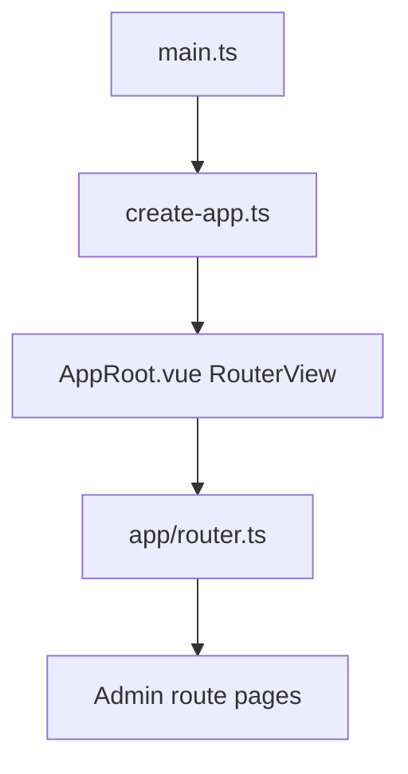

# Current Admin Frontend Topology

## Entry Flow



- App bootstrap enters the router through `apps/frontend/src/main.ts`, `apps/frontend/src/app/create-app.ts`, and `apps/frontend/src/app/AppRoot.vue`.
- Admin route registration and route guard live in `apps/frontend/src/app/router.ts`.
- Legacy router compatibility export exists at `apps/frontend/src/router/index.ts`.

## Route Topology

| Route | Name | Page / Behavior | Auth |
| --- | --- | --- | --- |
| `/admin/login` | `admin-login` | `apps/frontend/src/pages/AdminLoginPage.vue` | login entry |
| `/admin/anchor-events` | `admin-anchor-events` | `apps/frontend/src/pages/AdminAnchorEventPage.vue` | `requiresAdminAuth` |
| `/admin/pr` | `admin-pr` | `apps/frontend/src/pages/AdminPRPage.vue` | `requiresAdminAuth` |
| `/admin/pr-messages` | `admin-pr-messages` | redirect to `admin-pr` | compatibility route |
| `/admin/booking-support` | `admin-booking-support` | `apps/frontend/src/pages/AdminBookingSupportPage.vue` | `requiresAdminAuth` |
| `/admin/booking-execution` | `admin-booking-execution` | `apps/frontend/src/pages/AdminBookingExecutionPage.vue` | `requiresAdminAuth` |
| `/admin/pois` | `admin-pois` | `apps/frontend/src/pages/AdminPoisPage.vue` | `requiresAdminAuth` |
| `/admin/feedback-questionnaires` | `admin-feedback-questionnaires` | `apps/frontend/src/pages/AdminFeedbackQuestionnairesPage.vue` | `requiresAdminAuth` |

Admin guard:

- Location: `apps/frontend/src/app/router.ts`
- Predicate: `getStoredAdminHasAccess()`
- Failure target: `admin-login` with `redirect` query.

## Admin Domain Structure

```text
apps/frontend/src/domains/admin/
|-- model/
|   `-- admin-session-storage.ts
|-- queries/
|   |-- useAdminAnchorEventLandingConfig.ts
|   |-- useAdminAnchorEventPreferenceTags.ts
|   |-- useAdminAnchorEvents.ts
|   |-- useAdminAnchorManagement.ts
|   |-- useAdminBookingExecution.ts
|   |-- useAdminBookingSupport.ts
|   |-- useAdminFeedbackQuestionnaires.ts
|   |-- useAdminLogin.ts
|   |-- useAdminPoiManagement.ts
|   `-- useAdminPRManagement.ts
|-- ui/
|   `-- composites/
|       `-- AdminNavigationCard.vue
`-- use-cases/
    |-- useAdminAccess.ts
    `-- useAdminSessionStore.ts
```

### Model

- `admin-session-storage.ts`
  - owns admin localStorage / memory state for admin user id, access token, and role.
  - exports `getStoredAdminHasAccess()` used by the router guard.

### Use Cases

- `useAdminSessionStore.ts`
  - Pinia store `adminSession`.
  - owns `hasAdminAccess`, `applyAuthSession`, `clearSession`, and token mutation.
- `useAdminAccess.ts`
  - page-level access helper.
  - exposes `isAdmin` and `logout`.

### Query Modules

| Module | Primary Exports | Backend API Family |
| --- | --- | --- |
| `useAdminLogin.ts` | `useAdminLogin` | `auth.admin.login` |
| `useAdminAnchorEvents.ts` | workspace, create event, update event | `admin.anchor-events` |
| `useAdminAnchorEventLandingConfig.ts` | get / replace landing config | `admin.events/:eventId/landing-config` |
| `useAdminAnchorEventPreferenceTags.ts` | get, replace, publish, reject tags | `admin.events/:eventId/preference-tags` |
| `useAdminPRManagement.ts` | workspace, PR CRUD, status, visibility, feedback instance, message CRUD | `admin.pr`, `admin.prs` |
| `useAdminBookingSupport.ts` | get / replace booking support resources | `admin.events/:eventId/booking-support-resources` |
| `useAdminBookingExecution.ts` | execution workspace, submit result, release partner | `admin.booking-execution`, `admin.prs/:id/booking-execution`, `admin.prs/:id/partners/:partnerId/release` |
| `useAdminPoiManagement.ts` | list, by ids, upsert, publish, reject | `admin.pois` |
| `useAdminFeedbackQuestionnaires.ts` | list, create, update questionnaire templates | `admin.feedback-questionnaires.templates` |
| `useAdminAnchorManagement.ts` | re-export barrel | compatibility query entry |

### Admin Shell UI

- `AdminNavigationCard.vue`
  - Shared Admin navigation card used by protected Admin pages.
  - Links to activity management, PR management, booking support config, booking execution, and POI config.

## Page Dependency Map

```mermaid
flowchart TD
  Login["AdminLoginPage"] --> LoginQ["useAdminLogin"]
  Login --> Session["useAdminSessionStore"]

  Anchor["AdminAnchorEventPage"] --> Access["useAdminAccess"]
  Anchor --> AnchorQ["useAdminAnchorEventWorkspace / create / update"]
  Anchor --> LandingQ["landing config queries"]
  Anchor --> TagsQ["preference tag queries"]

  PR["AdminPRPage"] --> Access
  PR --> PRQ["useAdminPRWorkspace / PR mutations"]
  PR --> MsgQ["useAdminPRMessages / message mutations"]
  PR --> PoiQ["useAdminPois"]

  BookingSupport["AdminBookingSupportPage"] --> Access
  BookingSupport --> AnchorQ
  BookingSupport --> SupportQ["booking support queries"]

  BookingExecution["AdminBookingExecutionPage"] --> Access
  BookingExecution --> ExecutionQ["booking execution queries"]

  Pois["AdminPoisPage"] --> Access
  Pois --> PoiMgmtQ["POI management queries"]

  Feedback["AdminFeedbackQuestionnairesPage"] --> Access
  Feedback --> FeedbackQ["feedback questionnaire template queries"]

  LoginQ --> Client["adminClient"]
  AnchorQ --> Client
  LandingQ --> Client
  TagsQ --> Client
  PRQ --> Client
  MsgQ --> Client
  PoiQ --> Client
  SupportQ --> Client
  ExecutionQ --> Client
  PoiMgmtQ --> Client
  FeedbackQ --> Client
```



## Admin RPC Transport

- Location: `apps/frontend/src/lib/admin-rpc.ts`
- `adminFetch` attaches `Authorization: Bearer <admin token>` from admin session storage.
- `x-access-token` response header rotates the stored token.
- `401` clears the admin session and redirects to `/admin/login?redirect=<current path>`.

## Query Key Topology

- Location: `apps/frontend/src/shared/api/query-keys.ts`
- Admin keys:
  - `anchorEventWorkspace`
  - `anchorEventLandingConfig`
  - `anchorEventPreferenceTags`
  - `pois`
  - `poisByIds`
  - `feedbackQuestionnaireTemplates`
  - `bookingSupport`
  - `bookingExecutionWorkspace`
  - `prWorkspace`
  - `prMessages`

## Compatibility / Retained Surface

- `/admin/pr-messages` routes to `admin-pr`.
- The standalone `apps/frontend/src/pages/AdminPRMessagesPage.vue` implementation was removed in Slice 11; the redirect remains as a compatibility route.
- `apps/frontend/src/domains/admin/queries/useAdminAnchorManagement.ts` is a re-export barrel with no current usage found in the inspected frontend source.

## Page Size Pressure

| Page | Current lines |
| --- | ---: |
| `AdminAnchorEventPage.vue` | 627 |
| `AdminPRPage.vue` | 15 |
| `AdminPoisPage.vue` | 168 |
| `AdminBookingExecutionPage.vue` | 88 |
| `AdminFeedbackQuestionnairesPage.vue` | 453 |
| `AdminBookingSupportPage.vue` | 125 |
| `AdminLoginPage.vue` | 212 |
| `AdminPRBasicView.vue` | 956 |
| `AdminPRMessagesView.vue` | 529 |

The remaining highest-pressure files are PR section views. They now share the Admin scaffold and PR filter rail, while their form and message internals remain the next fine-grained component split candidate.
