# Current Admin Information Architecture

## Navigation Model

Current navigation is exposed through `AdminNavigationCard.vue`:

1. 活动管理
2. PR 管理
3. 预订与资助配置
4. 预订执行控制台
5. POIs 配置
6. 反馈问卷模板

The login page is outside the protected Admin navigation. The PR system-message route remains as a redirect alias and is not present in the current navigation card.

## Target Navigation Model

User-preferred target grouping:

| Top-level group | Second-level item | Current route owner | Current section owner |
| --- | --- | --- | --- |
| 活动管理 | 活动基本信息 | `admin-anchor-events` | anchor-event base editor |
| 活动管理 | 活动场地 | `admin-anchor-events` | location pools and meeting points |
| 活动管理 | 活动时间 | `admin-anchor-events` | time windows and event-level participation policy |
| 活动管理 | 活动标签 | `admin-anchor-events` | tag pool and tag moderation |
| 活动管理 | 其它 | `admin-anchor-events` | event join thresholds, event feedback questionnaire, landing split mode |
| PR 管理 | PR 基本 | `admin-pr` | PR create/edit workflow |
| PR 管理 | PR 留言 | `admin-pr` | PR messages view |
| 支持资源 | 资助配置 | `admin-booking-support` | event support resources |
| 支持资源 | 资助执行 | `admin-booking-execution` | execution queue and audit |
| POIs 管理 | POI 基本 | `admin-pois` | ID, gallery, capacity, meeting point, availability rules |
| POIs 管理 | POI 审核 | `admin-pois` | publish/reject review workflow |
| 反馈问卷 | 反馈问卷模板 | `admin-feedback-questionnaires` | template editor |

Implication:

- second-level Admin navigation needs to support both route targets and in-route section targets.
- existing URLs can remain stable while the navigation model adds route section metadata.
- `AdminSecondaryNav` and page section anchors should use the same section ids as the global Admin navigation model.

## IA Overview

```mermaid
flowchart TD
  Admin["Admin"] --> Session["访问与会话"]
  Admin --> AnchorEvent["活动配置 / Anchor Event"]
  Admin --> PR["PR 运营"]
  Admin --> BookingConfig["预订与资助配置"]
  Admin --> BookingExec["预订执行"]
  Admin --> POI["POI 运营"]
  Admin --> Feedback["反馈问卷模板"]

  Session --> Login["登录 / token / service role"]

  AnchorEvent --> EventBase["活动基础信息"]
  AnchorEvent --> Locations["场地池 / 碰头地点"]
  AnchorEvent --> TimePool["时间池策略 / 时间窗口预览"]
  AnchorEvent --> Landing["Landing Rollout"]
  AnchorEvent --> Preferences["偏好标签池 / 审核"]

  PR --> Search["全局筛选"]
  PR --> PRList["PR 列表"]
  PR --> PREdit["创建 / 编辑 / 删除"]
  PR --> State["状态 / 可见性"]
  PR --> Feedback["反馈问卷实例"]
  PR --> Messages["PR 留言"]

  BookingConfig --> Resources["活动级资源模板"]

  BookingExec --> Pending["待处理预订"]
  BookingExec --> Submit["提交执行结果"]
  BookingExec --> Release["释放联系人"]
  BookingExec --> Audit["执行审计"]

  POI --> Review["审核"]
  POI --> Gallery["图库"]
  POI --> Capacity["容量"]
  POI --> Availability["可用时间规则"]
  POI --> MeetingPoint["会合点"]

  Feedback --> Templates["模板列表"]
  Feedback --> Definition["JSON definition editor"]
```

## Surface Details

### 访问与会话

- Route: `/admin/login`
- Page: `AdminLoginPage.vue`
- User-facing role:
  - login with service-role admin UUID and password
  - redirect to requested Admin route after successful login
- Technical ownership:
  - `useAdminLogin`
  - `useAdminSessionStore`
  - `admin-session-storage`
  - router guard

### 活动管理

- Route: `/admin/anchor-events`
- Page: `AdminAnchorEventPage.vue`
- Main user-facing groups:
  - anchor-event list
  - anchor-event info
  - location pools
  - default meeting point
  - location-specific meeting points
  - default participation policy
  - time-pool strategy
  - generated time-window preview
  - landing rollout
  - preference tags and pending tag moderation
- Query ownership:
  - `useAdminAnchorEventWorkspace`
  - `useCreateAdminAnchorEvent`
  - `useUpdateAdminAnchorEvent`
  - `useAdminAnchorEventLandingConfig`
  - `useReplaceAdminAnchorEventLandingConfig`
  - `useAdminAnchorEventPreferenceTags`
  - `useReplaceAdminAnchorEventPreferenceTags`
  - `usePublishAdminAnchorEventPreferenceTag`
  - `useRejectAdminAnchorEventPreferenceTag`

### PR 管理

- Route: `/admin/pr`
- Page: `AdminPRPage.vue`
- View owners:
  - `AdminPRBasicView.vue`
  - `AdminPRMessagesView.vue`
- Main user-facing groups:
  - filter panel by type, location, status, start lower bound, end upper bound
  - PR list
  - PR create / edit form
  - participation policy controls
  - status controls
  - visibility controls
  - feedback questionnaire instance controls
  - delete PR action
  - PR message list, create message, edit message, delete message
- Query ownership:
  - `useAdminPRWorkspace`
  - `useCreateAdminPR`
  - `useDeleteAdminPR`
  - `useUpdateAdminPRContent`
  - `useUpdateAdminPRStatus`
  - `useUpdateAdminPRVisibility`
  - `useUpdateAdminPRFeedbackQuestionnaireInstance`
  - `useAdminPRMessages`
  - `useCreateAdminPRMessage`
  - `useUpdateAdminPRMessage`
  - `useDeleteAdminPRMessage`
  - `useAdminPois`

### 预订与资助配置

- Route: `/admin/booking-support`
- Page: `AdminBookingSupportPage.vue`
- Main user-facing groups:
  - anchor-event selector
  - event-level resource templates
  - resource properties such as booking requirement, lock behavior, transfer requirement, location scope, handler, deadline, cancellation policy, settlement, subsidy, summary, and detail rules
- Query ownership:
  - `useAdminAnchorEventWorkspace`
  - `useAdminBookingSupportConfig`
  - `useReplaceEventBookingSupportResources`
- Locale still contains retired batch override copy under `adminBookingSupport`, while the current page surface centers on event-level resources.

### 预订执行控制台

- Route: `/admin/booking-execution`
- Page: `AdminBookingExecutionPage.vue`
- Main user-facing groups:
  - search and stats
  - pending booking execution list
  - execution result submission
  - manual partner/contact release
  - audit list
  - notification result summary in audit records
- Query ownership:
  - `useAdminBookingExecutionWorkspace`
  - `useSubmitAdminPRBookingExecution`
  - `useReleaseAdminPRPartnerForExecution`

### POIs 配置

- Route: `/admin/pois`
- Page: `AdminPoisPage.vue`
- Main user-facing groups:
  - POI selector and creation
  - submission review status
  - publish / reject actions
  - per-time-window capacity
  - meeting point config
  - gallery image management
  - availability rules
- Query ownership:
  - `useAdminPois`
  - `useUpsertAdminPoi`
  - `usePublishAdminPoi`
  - `useRejectAdminPoi`

### 反馈问卷模板

- Route: `/admin/feedback-questionnaires`
- Page: `AdminFeedbackQuestionnairesPage.vue`
- Main user-facing groups:
  - template selector
  - create template action
  - key, version, title fields
  - JSON definition editor
  - save action
- Query ownership:
  - `useAdminFeedbackQuestionnaireTemplates`
  - `useCreateAdminFeedbackQuestionnaireTemplate`
  - `useUpdateAdminFeedbackQuestionnaireTemplate`

## Current Structural Observations

- Admin pages are route entrypoints and also own large amounts of form state, selection state, validation, serialization, and mutation orchestration.
- Domain Admin UI currently has one shared composite: `AdminNavigationCard.vue`.
- Shared query and transport seams are coherent, while page-level composition has high density.
- The current IA mixes product configuration, operational execution, content moderation, and data-library management at the same navigation level.
- `/admin/pr-messages` is now a compatibility redirect into `PR 管理`; the standalone retained page implementation has been removed.
