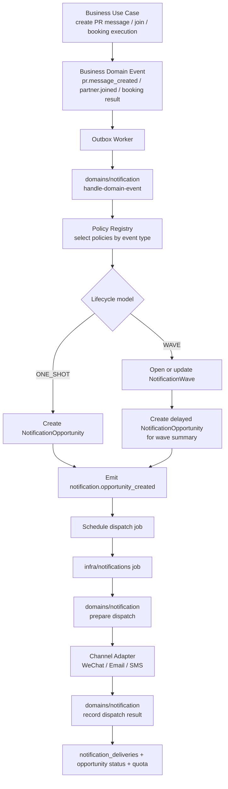
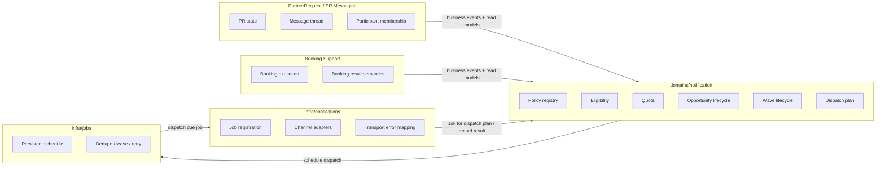
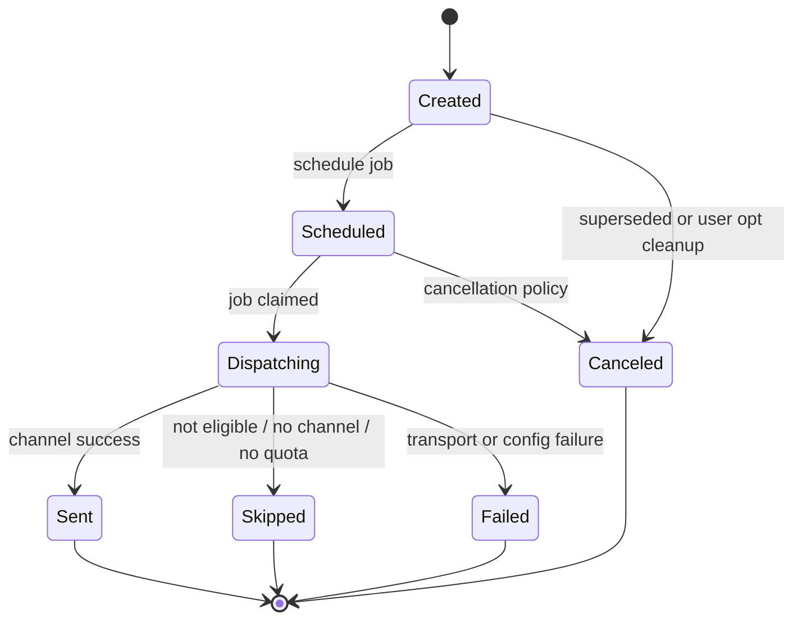
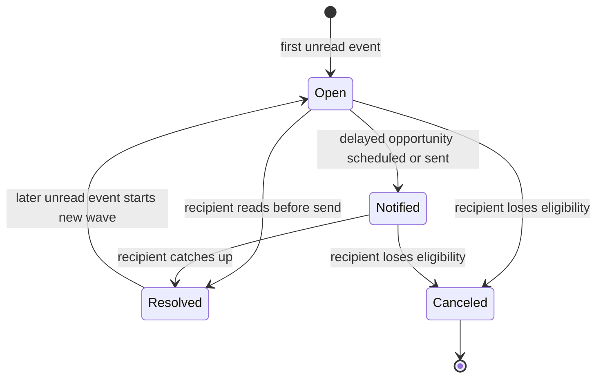

# Notification And Reliability Dossier

## 1. What It Is, And What It Is Not

Notification And Reliability is the business policy around user-reachable notification opportunities that support collaboration trust.

It is:

- the rule set for when a user may be prompted, reminded, or notified
- the quota model for WeChat subscription opportunities
- the delayed notification wave model for PR messages
- the revalidation policy before asynchronous notification delivery
- the observable delivery outcome model

It is not:

- the WeChat transport adapter itself
- a generic background job runner
- a generic marketing notification system
- realtime chat, presence, typing indicators, or read receipts
- a frontend-owned state machine

Current smell: code mostly houses notification execution under `infra/notifications`, but part of the behavior is business policy rather than pure infrastructure.

## 2. Why It Exists

It exists to turn weak asynchronous collaboration into credible collaboration.

The product needs users to know when:

- a joined Anchor PR needs confirmation or is near start
- a new partner joins
- a booking result is available
- a PR message unread wave needs attention

The responsibility is not "send messages". The responsibility is: preserve bounded, reliable user attention opportunities without spamming, stale delivery, or frontend inference.

## 3. Lifecycle

Generic notification opportunity lifecycle:

1. A business action or temporal condition creates a potential notification opportunity.
2. The system checks whether the recipient has the required identity, subscription state, and remaining quota.
3. If delayed delivery is needed, the backend persists a DB-backed job with dedupe semantics.
4. At execution time, the backend reloads current state.
5. The backend revalidates recipient activity, PR participation, opt state, channel configuration, and wave freshness.
6. The transport attempt is sent, skipped, or failed.
7. Delivery outcome is recorded in `notification_deliveries`.
8. Successful sends consume quota when that notification kind uses quota.
9. Rejection signals such as WeChat refusal can clear remaining credits and cancel pending jobs.

PR message unread-wave lifecycle:

1. A participant or operator creates a PR message.
2. The backend identifies current active participants except the author.
3. For each recipient, the backend checks whether an unread wave is already pending.
4. If no pending wave exists and quota allows, the backend marks `lastNotifiedMessageId` for that recipient and schedules one delayed job.
5. When the job runs, it recomputes unread count and latest unread sender from persisted messages.
6. If the recipient has already read the wave or is no longer eligible, the job records a skipped delivery.
7. A later unread wave may create a new opportunity only after the earlier wave is caught up.

## 4. Inputs And Outputs

Inputs:

- domain actions: join, exit, confirmation, check-in, PR message creation, booking execution submission
- temporal inputs: confirmation window, activity start, booking-result timing, PR message debounce window
- user state: active status, openId, notification opts, remaining quota
- PR state: current active participants, PR status, message inbox state
- environment state: WeChat template configuration, backend job runner availability

Outputs:

- persisted jobs
- notification delivery records
- quota mutation
- skipped / failed / success delivery outcomes
- WeChat subscription or template message calls
- frontend-visible subscription and delivery-adjacent state

## 5. External Conditions

Important external conditions:

- WeChat availability and configured template IDs
- bound `openid`
- user refusal codes such as `43101`
- scale-to-zero runtime, which forbids in-memory timers as durable truth
- job resolution and tolerance policy
- current PR participation at execution time
- message read-marker freshness
- backend/frontend URL configuration for notification landing pages

Most complexity here is environment coupling plus stale-state prevention, not the core idea of "notify user".

## 6. Invariants

Hard invariants:

- Notification subscription is modeled as remaining send quota, not as a simple boolean toggle.
- PR message notification is at most one send per `PR / recipient / unread wave`.
- Async notification execution must revalidate current active PR participation.
- Hidden fetches must not clear message unread state; read-marker advancement is explicit.
- Delayed work must be DB-backed, not in-process timers.
- Delivery outcomes should be recorded even when skipped or failed.
- WeChat refusal should clear unusable credits and cancel pending jobs for that kind/user where appropriate.

Likely invariants that should be made more explicit:

- The owner of notification eligibility policy is backend domain policy, even when execution lives under infra.
- Transport-specific failure mapping should not become the source of business semantics.

## 7. How It Is Observed And Changed

Changed by:

- user subscription update actions
- PR lifecycle actions that schedule or cancel reminder jobs
- PR message creation
- admin booking execution submission
- WeChat refusal cleanup
- job runner execution

Observed through:

- user notification option state
- `notification_deliveries`
- job backlog and job execution logs
- PR message inbox state
- product telemetry and operation logs where applicable

Domain events are used for some PR actions, but not every notification policy change is explicitly represented as a domain event.

## 8. Boundaries With Other Concepts

With `PartnerRequest Core`:

- PR owns participant state, message thread state, and lifecycle status.
- Notification policy consumes PR truth; it should not become the owner of PR membership.

With `Identity And Session`:

- Identity owns user, openId, and active account state.
- Notification consumes those facts to decide deliverability.

With `Booking Support`:

- Booking execution creates booking-result notification opportunities.
- Booking Support owns fulfillment semantics; Notification owns attention and delivery semantics.

With `Infra / Jobs / WeChat`:

- Jobs own persistence, dedupe, leases, retries, and scheduling mechanics.
- WeChat services own transport protocol.
- Notification policy should sit above both, even if current files are still under infra.

## Evidence

- PRD names Notifications And Reliability as a capability: `docs/10-prd/behavior/capabilities.md`.
- PRD defines quota, unread-wave, and revalidation rules: `docs/10-prd/behavior/rules-and-invariants.md`.
- Product TDD marks notifications, jobs, and delivery records as backend-authoritative state: `docs/20-product-tdd/system-state-and-authority.md`.
- PR Messaging Contract contains current unread-wave notification semantics: `docs/20-product-tdd/cross-unit-contracts.md`.
- Current execution code: `apps/backend/src/infra/notifications/wechat-pr-message.ts`.
- Current schedule policy: `apps/backend/src/infra/notifications/job-schedule-policy.ts`.
- Current notification state entities: `apps/backend/src/entities/user-notification-opt.ts`, `apps/backend/src/entities/notification-delivery.ts`, `apps/backend/src/entities/pr-message-inbox-state.ts`.

## Open Questions

- Resolved: create a backend `domains/notification` boundary for policy while `infra/notifications` keeps transport and job execution.
- Resolved: move PR message unread-wave policy into `domains/notification`.
- Resolved: represent notification opportunity creation consistently as domain events.
- Resolved: split notification contracts out of the PR Messaging section in Product TDD when promoting durable design.

Important design refinement: upstream business domains should usually emit their own business events, such as `pr.message_created`, `partner.joined`, or `anchor.pr.booking_execution_submitted`. `domains/notification` should consume those business events, apply notification policy, and then emit notification-specific events such as `notification.opportunity_created` or `notification.wave_opened`. This keeps PR, Booking Support, and future domains from depending directly on notification strategy names.

Additional direction:

- `infra/notifications` should be channel-ready. WeChat should become one channel adapter, not the notification boundary.
- Future channels such as email and SMS should plug into the same dispatch abstraction.
- `domains/notification` should support future business domains, not only PR Core or PR Messaging.
- The current model likely needs two lifecycle families:
  - one-shot notification opportunities, such as booking result, activity start, and new partner
  - wave-based notification opportunities, such as PR message unread waves

## Promotion Candidates

Potential durable truths to promote later:

- "Notification" is a backend-owned reliability policy boundary, not just infra.
- "WeChat" is a transport implementation detail under notification delivery.
- `PR_MESSAGE` unread-wave semantics deserve either a Product TDD sub-contract or a Unit TDD hard-local doc.

## Low-Level Design Draft

### Target Module Shape

```text
apps/backend/src/
  domains/
    notification/
      index.ts
      model/
        notification-kind.ts
        notification-channel.ts
        notification-opportunity.ts
        notification-wave.ts
        notification-event.ts
      services/
        domain-event-router.service.ts
        notification-policy-registry.service.ts
        notification-opportunity.service.ts
        notification-wave.service.ts
        notification-eligibility.service.ts
        notification-quota.service.ts
        notification-dispatch-plan.service.ts
        policies/
          pr-message-unread-wave.policy.ts
          new-partner.policy.ts
          activity-start-reminder.policy.ts
          booking-result.policy.ts
      use-cases/
        handle-domain-event.ts
        create-notification-opportunities.ts
        open-notification-wave.ts
        mark-wave-read.ts
        prepare-notification-dispatch.ts
        record-notification-dispatch-result.ts

  infra/
    notifications/
      index.ts
      channels/
        notification-channel-adapter.ts
        wechat-subscription.adapter.ts
        wechat-template.adapter.ts
        email.adapter.ts
        sms.adapter.ts
      jobs/
        notification-dispatch-job.ts
        notification-job-registration.ts
      scheduling/
        job-schedule-policy.ts
```

Existing WeChat-specific files can migrate incrementally. The first pass should not require adding email/SMS implementations; it should only make the adapter seam real.

### Core Types

```ts
type NotificationLifecycleModel = "ONE_SHOT" | "WAVE";

type NotificationChannel = "WECHAT_SUBSCRIPTION" | "WECHAT_TEMPLATE" | "EMAIL" | "SMS";

type NotificationOpportunityStatus =
  | "CREATED"
  | "SCHEDULED"
  | "DISPATCHING"
  | "SENT"
  | "SKIPPED"
  | "FAILED"
  | "CANCELED";

type NotificationWaveStatus =
  | "OPEN"
  | "NOTIFIED"
  | "RESOLVED"
  | "CANCELED";

type NotificationOpportunity = {
  id: string;
  kind: NotificationKind;
  lifecycleModel: NotificationLifecycleModel;
  aggregateType: string;
  aggregateId: string;
  recipientUserId: UserId;
  channelPreference: NotificationChannel[];
  dedupeKey: string;
  runAt: Date;
  payload: Record<string, unknown>;
  status: NotificationOpportunityStatus;
};

type NotificationWave = {
  id: string;
  kind: NotificationKind;
  aggregateType: string;
  aggregateId: string;
  recipientUserId: UserId;
  waveKey: string;
  waveStartEventId: string;
  status: NotificationWaveStatus;
  openedAt: Date;
  lastNotifiedAt: Date | null;
  resolvedAt: Date | null;
};
```

The names above are design-level names. Final entity/table names should be chosen when implementing migrations.

### Event Flow



### Boundary Diagram



### One-Shot Lifecycle



### Wave Lifecycle



Wave lifecycle and opportunity lifecycle intentionally remain separate. A wave can produce one or more opportunities over time in future versions, but current PR message policy should keep one opportunity per `PR / recipient / unread wave`.

### Event Type Additions

Potential notification-owned domain events:

```ts
type NotificationDomainEventType =
  | "notification.opportunity_created"
  | "notification.opportunity_scheduled"
  | "notification.dispatch_succeeded"
  | "notification.dispatch_skipped"
  | "notification.dispatch_failed"
  | "notification.wave_opened"
  | "notification.wave_resolved"
  | "notification.wave_canceled";
```

Business event producers should not need to import these names. These events are emitted by `domains/notification` after policies run.

### Data Model Direction

Minimum durable tables for a clean boundary:

- `notification_opportunities`
  - one row per send opportunity
  - owns lifecycle status, dedupe key, recipient, kind, aggregate, run time, channel preference, payload snapshot
- `notification_waves`
  - one row per wave lifecycle, initially for PR message unread waves
  - owns wave key, recipient, status, start event/message, last notified, resolved time
- existing `notification_deliveries`
  - stays as delivery-attempt/outcome log
- existing `user_notification_opts`
  - stays as subscription/quota state unless renamed later

Incremental option: first introduce `domains/notification` services around existing `pr_message_inbox_states`, jobs, and `notification_deliveries`, then add `notification_opportunities` / `notification_waves` when the policy boundary is stable.

### Refactor Sequence

1. Add `domains/notification` with pure services and policies, no schema change yet.
2. Move PR message unread-wave decision logic out of `create-pr-message.ts` and `infra/notifications/wechat-pr-message.ts` into `domains/notification/services/policies/pr-message-unread-wave.policy.ts`.
3. Keep `infra/notifications/wechat-pr-message.ts` as a job/channel executor that calls `prepareNotificationDispatch` and `recordNotificationDispatchResult`.
4. Change notification scheduling from use-case-local direct calls to event consumer flow:
   - business use case emits business event
   - outbox worker routes event to notification domain
   - notification domain emits opportunity-created event and schedules job
5. Add Product TDD notification contract doc and move PR message notification rules out of the PR Messaging section.
6. Add `notification_opportunities` and `notification_waves` only when the service boundary has proven stable.

## Implementation Notes

### Slice 1 - 2026-04-19

Implemented the first backend boundary slice without schema changes.

Changed:

- Added `apps/backend/src/domains/notification`.
- Moved pure unread-wave notification checks into `domains/notification/model/unread-wave.ts`.
- Moved PR message unread-wave opportunity creation policy into `domains/notification/services/pr-message-unread-wave.service.ts`.
- Added PR message dispatch preparation/result helpers under `domains/notification/services/pr-message-dispatch.service.ts`.
- Added notification outbox handling for `pr.message_created`.
- Removed direct PR message notification scheduling from `pr-core/use-cases/create-pr-message.ts`.
- Registered notification outbox handlers from backend startup while injecting the current WeChat scheduler/configuration functions.
- Added `notification.wave_opened` and `notification.opportunity_created` event types.
- Kept existing WeChat job scheduling and delivery tables unchanged.

Current deliberate compromises:

- `notification_opportunities` and `notification_waves` tables are not added yet; existing `pr_message_inbox_states`, jobs, and `notification_deliveries` still carry persistence.
- `infra/notifications/wechat-pr-message.ts` still owns WeChat channel execution and job registration, but now calls notification-domain preparation and delivery recording helpers.
- Opportunity creation is now event-driven from persisted `pr.message_created` outbox events, but other notification kinds still use their existing use-case-local scheduling paths.

Verification:

- `pnpm --filter @partner-up-dev/backend typecheck`
- `pnpm --filter @partner-up-dev/backend exec tsx --test src/domains/pr-core/services/pr-message-thread.service.test.ts src/infra/notifications/wechat-pr-message.test.ts`
- `pnpm --filter @partner-up-dev/backend exec tsx --test src/services/WeChatSubscriptionMessageService.test.ts`
- `pnpm --filter @partner-up-dev/backend db:lint`
- `pnpm --filter @partner-up-dev/backend build`
- `pnpm --filter @partner-up-dev/frontend build`
- `pnpm --filter @partner-up-dev/backend exec tsx --test src/domains/pr-core/services/pr-message-thread.service.test.ts`
- `pnpm --filter @partner-up-dev/backend exec tsx --test src/infra/notifications/wechat-pr-message.test.ts`

### Slices 2-10 - 2026-04-19

Implemented the approved boundary continuation.

Changed:

- Added notification domain models for `NotificationKind`, `NotificationChannel`, and neutral dispatch result.
- Added WeChat subscription/template channel adapters under `infra/notifications/channels`.
- Reworked PR message, booking-result, activity-start reminder, confirmation reminder, and new-partner jobs to use channel adapters.
- Moved each notification kind's dispatch preparation, delivery recording, quota mutation, dedupe key, and schedule policy helpers into `domains/notification/services`.
- Added generic `createNotificationOpportunity` and `markNotificationOpportunityScheduled` helpers.
- Added `notification_opportunities` and `notification_waves` entities, repositories, and migration `0023_notification_opportunity_wave.sql`.
- Linked PR message unread-wave creation to persisted `notification_waves` and `notification_opportunities`.
- Linked one-shot notification scheduling to persisted `notification_opportunities`.
- Updated outbox event delivery to expose the source domain event id to consumers.
- Split Product TDD notification contract into `docs/20-product-tdd/notification-contracts.md`.
- Updated Product TDD state authority to include notification opportunities and waves.
- Moved frontend join-success notification prompt state into `apps/frontend/src/domains/notification/use-cases/useJoinSuccessNotificationPrompt.ts`.
- Removed PR message unread-wave policy re-export from `pr-core/services/pr-message-thread.service.ts`.
- Removed PR message debounce policy re-export from `infra/notifications/wechat-pr-message.ts`.

Current deliberate compromises:

- `notification_opportunities` status is advanced to `SCHEDULED` at scheduling time, while dispatch-time transitions such as `DISPATCHING`, `SENT`, `SKIPPED`, and `FAILED` remain future work.
- Existing job types and payloads stay stable to keep the runtime migration small.
- Reminder opportunities record `WECHAT_SUBSCRIPTION` as the preferred channel even though dispatch can fall back to WeChat template when subscription templates are unavailable.
- Booking-result dispatch still uses one job for multiple recipients, with one opportunity row per recipient.

Verification:

- `pnpm --filter @partner-up-dev/backend typecheck`

### Future Slice 11

Introduce a channel-preference and recipient-address model.

Target direction:

- store per-recipient channel preference at opportunity creation time
- represent channel addresses independently from WeChat `openid`
- support fallback order such as WeChat subscription -> email -> SMS where product policy permits
- keep quota semantics per channel/kind rather than assuming WeChat quota applies to every channel

Likely data additions:

- `notification_channel_preferences`
- `notification_recipient_addresses`
- optional `channel_preference` JSON field on `notification_opportunities`

### Future Slice 12

Implement the first non-WeChat channel adapter.

Recommended first adapter:

- email for operationally important, low-urgency notifications such as booking result

Why email first:

- lower immediate compliance and cost pressure than SMS
- easier manual verification in staging
- enough value to validate the adapter seam without changing short-window reminder semantics

Guardrail:

- add the channel only through `infra/notifications/channels`
- keep product eligibility, opportunity creation, and delivery recording inside `domains/notification`
