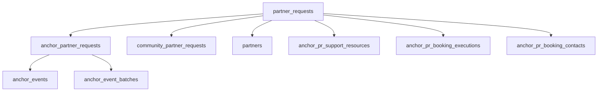
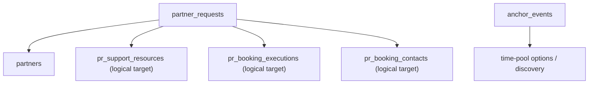

# Slice 2 - Single PR Data Model Blueprint

## Objective

Define the target durable data model for the combined task:

- `pr-core` rewrite
- issue `#167`
- issue `#170`

This slice fixes the data topology before schema changes begin.

## Outcome

The system converges on:

- one root PR table
- one `Partner` submodule storage shape
- no PR-side `pr_kind`
- no PR-side `anchorEventId`
- no PR-side `batchId`
- no PR-side `locationSource`
- no PR-side `bookingTriggeredAt`
- no `anchor_partner_requests`
- no `community_partner_requests`

## Current Durable Topology



Current problems:

- `partner_requests` is a mixed root table with `pr_kind`
- `anchor_partner_requests` mixes event linkage, visibility, participation policy, booking trigger time, and deprecated hiding behavior
- `community_partner_requests` stores acquisition-side data as if it were PR subtype identity
- booking-support runtime data is already keyed by `prId`, while create-time materialization still depends on `anchorEventId + batchId`

## Target Durable Topology



Key rule:

- `Anchor Event` may assist creation and discovery
- `PR` stores its own durable collaboration facts

## Target Table Ownership

### 1. `partner_requests`

Root collaboration object.

Target fields:

- `id`
- `title`
- `type`
- `time_window`
- `location`
- `status`
- `min_partners`
- `max_partners`
- `created_at`
- `created_by`
- `preferences`
- `notes`
- poster / thumbnail caches
- `visibility_status`
- `confirmation_start_offset_minutes`
- `confirmation_end_offset_minutes`
- `join_lock_offset_minutes`

Retirement from root:

- `pr_kind`

Reasoning:

- `visibility_status` is orthogonal to lifecycle and should stay close to the root object because it affects route-level discoverability across all PRs
- confirmation and join-lock offsets apply to the whole PR-level admission policy and have 1:1 cardinality with the PR root, so single-table storage keeps the migration and read path simpler
- `pr_kind` encodes a retired subtype model and has no place in the single-PR target

### 2. `partners`

No topology split in this slice.

It already owns:

- joined / confirmed / exited / released / attended status
- confirmation timestamps
- attendance timestamps
- check-in feedback

This table remains the per-participant lifecycle source of truth.

### 3. Booking Support Tables

Logical target names:

- `pr_support_resources`
- `pr_booking_contacts`
- `pr_booking_executions`

Current physical names can remain during the compatibility window:

- `anchor_pr_support_resources`
- `anchor_pr_booking_contacts`
- `anchor_pr_booking_executions`

Reasoning:

- these tables are already keyed by `prId`
- they no longer need anchor-specific semantics at the domain level
- physical rename can follow after behavior and query migration stabilize

## Field Ownership Matrix

| Current field | Current location | Target owner | Target location | Decision |
| --- | --- | --- | --- | --- |
| `pr_kind` | `partner_requests` | none | none | retire |
| `anchor_event_id` | `anchor_partner_requests` | Anchor Event create/discovery flow | transient input only | remove from PR storage |
| `batch_id` | `anchor_partner_requests` | Anchor Event time-pool assistance | transient input only | remove from PR storage |
| `location_source` | `anchor_partner_requests` | acquisition / operation log | no PR durable field | retire from PR model |
| `visibility_status` | `anchor_partner_requests` | PR root | `partner_requests.visibility_status` | move to root |
| `confirmation_start_offset_minutes` | `anchor_partner_requests` | Partner submodule | `partner_requests.confirmation_start_offset_minutes` | move |
| `confirmation_end_offset_minutes` | `anchor_partner_requests` | Partner submodule | `partner_requests.confirmation_end_offset_minutes` | move |
| `join_lock_offset_minutes` | `anchor_partner_requests` | Partner submodule | `partner_requests.join_lock_offset_minutes` | move |
| `booking_triggered_at` | `anchor_partner_requests` | Booking Support | booking-support-owned resource state | move out of PR |
| `auto_hide_at` | `anchor_partner_requests` | none | none | retire |
| `raw_text` | `community_partner_requests` | acquisition / analytics / operation log | no PR durable field | retire from PR model |
| `creation_source` | `community_partner_requests` | acquisition / analytics / operation log | no PR durable field | retire from PR model |

## Booking Support Landing Zone

`booking_triggered_at` leaves the PR model because it is resource-specific.

Target direction:

- booking trigger state becomes booking-support-owned
- the final landing zone should be resource-granular rather than PR-granular

Recommended target shape:

```text
pr_booking_resource_states
  pr_id
  target_resource_id
  pending_triggered_at
  cleared_at
  status
```

This aligns with the real model:

- one PR may carry multiple support resources
- different resources may enter pending booking at different times

Compatibility note:

- current admin booking workspace still reads one PR-level `bookingTriggeredAt`
- Slice 3 may keep a temporary compatibility read from `anchor_partner_requests.booking_triggered_at`
- booking-support migration should replace that read with resource-level state before subtype-table contract

## Acquisition And Event Context

### Community-side fields

`rawText` and `creationSource` do not belong to durable PR identity.

Target handling:

- request-time create payload
- operation log
- analytics payload
- optional create-attempt artifact later if product needs replay or audit

They do not need a subtype table replacement in the single-PR model.

### Event-side fields

`anchorEventId`, `batchId`, and `locationSource` move out of PR durable storage.

They remain valid as:

- assisted-create inputs
- discovery inputs
- operation-log detail
- analytics payload

They do not survive as PR-owned columns.

## Query-Key Migration

### Replace subtype identity keys

- `prKind` branches -> one `PR` route and DTO family
- `AnchorPRRepository` / `CommunityPR` read paths -> new `PR` read services plus event-side discovery services

### Replace event-owned PR keys

- `findByAnchorEventId` -> event-side discovery query by event type and active time-pool rules
- `findByBatchId` -> event-side discovery query by selected time-window option
- same-batch recommendation -> same time-window / compatible-option recommendation owned by Anchor Event discovery

### Replace PR detail back-link assumption

Current frontend detail pages use `anchorEventId` to build `/events/:eventId`.

Target direction:

- PR detail route may receive event referral context from navigation state or query
- event rediscovery should remain event-owned and not depend on PR durable linkage

## Compatibility Bridges

### Bridge A - Expand

Add:

- `partner_requests.visibility_status`
- `partner_requests.confirmation_start_offset_minutes`
- `partner_requests.confirmation_end_offset_minutes`
- `partner_requests.join_lock_offset_minutes`

No removals yet.

### Bridge B - Backfill

Backfill:

- `visibility_status` from `anchor_partner_requests`
- confirmation and join-lock offsets from `anchor_partner_requests`

Fallback defaults:

- non-anchor legacy rows receive `visibility_status = VISIBLE`
- non-anchor legacy rows may keep null confirmation and join-lock offsets

### Bridge C - Dual Read / Dual Write

During rollout:

- writes from admin anchor flows should write both new target storage and old subtype storage
- reads should gradually switch to:
  - root visibility from `partner_requests`
  - partner admission offsets from `partner_requests`

### Bridge D - Contract

After consumers switch:

- remove `partner_requests.pr_kind`
- remove `anchor_partner_requests`
- remove `community_partner_requests`

## Booking Support Compatibility

Current behavior already materializes PR support rows by `prId`.

This is good news:

- runtime PR booking-support reads already depend on `prId`
- event and batch identifiers are create-time inputs, not read-time necessities

Current limitation:

- create and admin-update flows call `materializePRSupportResources` with `anchorEventId + batchId`

Target direction:

- keep those values as transient assisted-create inputs until the event rewrite lands
- treat materialized support rows as the authoritative PR-side snapshot
- add an explicit re-materialize command later only if product requires it

Admin event-support updates currently do not fan out into existing PR rows, so this blueprint does not introduce a new reverse-propagation bridge.

## Remaining Physical Rename Targets

These symbols should retire by the end of the full task, though they do not block Slice 3 schema expand:

- `anchor_pr_support_resources`
- `anchor_pr_booking_contacts`
- `anchor_pr_booking_executions`
- `AnchorPRRepository`
- `AnchorPRPage`
- `CommunityPRPage`

## Recommended Rollout Order

1. finalize this blueprint
2. add root visibility and partner admission offsets to `partner_requests`
3. backfill anchor subtype data into new storage
4. switch root and partner-admission reads
5. remove `prKind` branches in backend and frontend symbols
6. rewrite Anchor Event create/discovery around type and time-window facts
7. move booking trigger state into booking-support-owned resource state
8. contract subtype tables
9. rename remaining anchor-specific PR-side booking/support tables

## Slice 3 Input Checklist

Slice 3 should produce:

- expand migration for `partner_requests.visibility_status`
- expand migration for partner admission offsets on `partner_requests`
- backfill migration from `anchor_partner_requests`
- compatibility write plan for admin and event-assisted create/update paths
- field-read switch list for:
  - `partner-section-view.service.ts`
  - `anchor-participation-policy.service.ts`
  - admin anchor management content / visibility flows
  - event-assisted create flows
